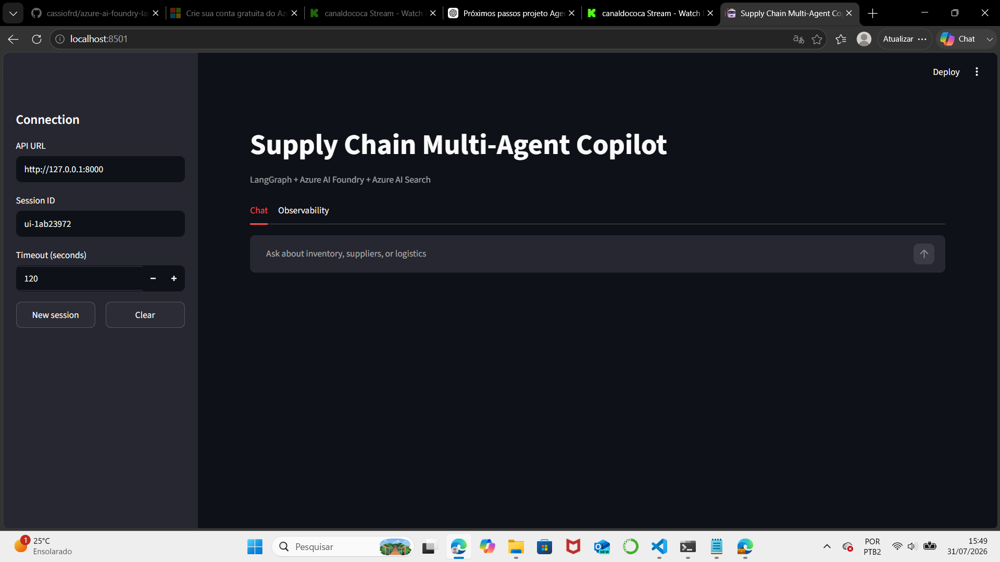
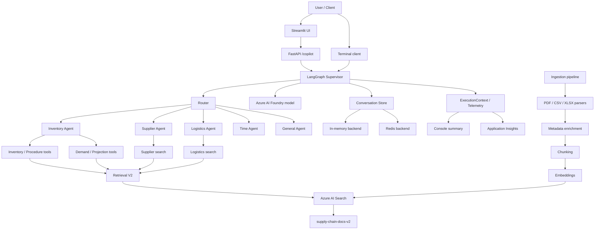

# Azure AI Foundry + LangGraph Multi-Agent Copilot

A production-oriented reference implementation of a **multi-agent supply-chain copilot** built with Azure AI Foundry, LangGraph, Azure AI Search, FastAPI, Streamlit, Azure Monitor, and optional Redis-backed conversation memory.

The project demonstrates how to move from a single LLM call to an observable and testable application that combines specialist agents, metadata-aware hybrid retrieval, deterministic business tools, grounded evidence, session memory, and automated evaluation.



## Highlights

- Supervisor-based orchestration with LangGraph
- Inventory, Supplier, Logistics, Time, and General specialists
- Dynamic single-agent and multi-agent routing
- Focused query planning for each specialist
- **Retrieval V2** over Azure AI Search
- Hybrid lexical + vector retrieval
- Entity alias resolution and location-aware metadata filtering
- Intent-aware reranking by document type
- Support for global procedures alongside entity-specific documents
- Structured ingestion for PDF, CSV, and XLSX sources
- Deterministic tools for exact inventory and demand facts
- Deterministic inventory projections that avoid unsupported demand double counting
- Grounded responses with title, source, and entity evidence
- Conversation sessions with in-memory or Redis storage
- Structured execution telemetry and Azure Monitor export
- FastAPI endpoints with Swagger documentation
- Streamlit chat and observability dashboard
- Automated evaluation with routing, tool-use, evidence, and answer checks
- Final evaluation dataset: **15/15 cases passed (100%)**

## Architecture



## Retrieval V2

Retrieval V2 separates **relevance-oriented retrieval** from **exact structured retrieval**.

The `supply-chain-docs-v2` Azure AI Search index stores document content together with metadata such as:

- `domain`
- `document_type`
- `entity_ids`
- `aliases`
- `location_ids`
- `supplier_ids`
- `is_global`
- source, page, row, and sheet information
- `content_vector`

For knowledge-oriented questions, the application uses hybrid search: lexical search and vector similarity are combined, metadata filters narrow the candidate set, and intent-aware reranking prioritizes the most appropriate document types.

Entity aliases such as `BOLT-M10`, `Bolt M10`, and `M10 Bolt` can resolve to the canonical entity `M10`. Global documents, such as procedures, can remain eligible even when an entity or plant filter is present.

## Deterministic tools vs. RAG

Not every enterprise question should be answered by asking an LLM to extract and calculate everything from retrieved text.

The application therefore uses two complementary patterns.

### Relevance-oriented RAG tools

These are appropriate when the task is primarily semantic retrieval and interpretation:

- `search_inventory_documents`
- `search_demand_documents`
- `search_procedure_documents`
- `search_supplier_documents`
- `search_logistics_documents`

### Structured deterministic tools

These are used when completeness, exact filtering, or arithmetic matters:

- `get_current_inventory` — exact on-hand, reserved, available, and snapshot values
- `get_open_production_orders` — complete open-order set and deterministic total
- `get_demand_forecast` — complete forecast rows for an item/location
- `calculate_inventory_projection` — deterministic inventory projections

`calculate_inventory_projection` keeps committed open orders and forecast demand as **separate scenarios** unless enterprise evidence establishes that they can safely be combined. This prevents unsupported double counting.

The LLM remains responsible for interpretation, orchestration, and synthesis; deterministic code handles calculations and exact structured extraction where appropriate.

## Ingestion pipeline

The `ingestion/` package builds the Retrieval V2 documents before they are indexed.

```text
Azure Blob documents
        |
        v
PDF / CSV / XLSX parsers
        |
        v
Metadata enrichment
        |
        v
Chunking
        |
        v
Embedding generation
        |
        v
Azure AI Search: supply-chain-docs-v2
```

Metadata enrichment identifies document type, entities, aliases, locations, suppliers, and global documents. This metadata is later used by Retrieval V2 for filtering and reranking.

## Repository layout

```text
apps/
  api/               FastAPI application
  streamlit/         Chat and observability UI
  supervisor/        Terminal client

evaluation/          Evaluation models, datasets, runner, and ignored reports
graphs/              LangGraph supervisor workflow
ingestion/           Parsing, enrichment, chunking, embeddings, and ingestion pipeline
scripts/             Index, ingestion, inspection, retrieval-test, and evaluation commands
shared/              Settings, Retrieval V2, tools, telemetry, memory, and clients
tests/               Automated test suite
data/documents/      Sample/reference documents when included
docs/                Documentation and assets
```

## Prerequisites

- Python 3.12+
- Azure AI Foundry project
- Chat model deployment in the Foundry project
- Embedding model deployment
- Azure AI Search service
- Azure Blob Storage for the ingestion source documents
- Optional: Application Insights for remote telemetry
- Optional: Redis or Azure Managed Redis for persistent sessions

## Installation

```powershell
# Clone and enter the repository
git clone https://github.com/cassiofrd/azure-ai-foundry-langgraph-agents.git
cd azure-ai-foundry-langgraph-agents

# Create and activate the virtual environment
python -m venv .venv
.\.venv\Scripts\Activate.ps1

# Install dependencies
python -m pip install --upgrade pip
pip install -r requirements.txt

# Create the local configuration file
Copy-Item .env.example .env
```

Fill in the required Azure endpoints and credentials in `.env`. The real `.env` file is ignored by Git.

## Build the Retrieval V2 index

Create or update the V2 Azure AI Search index:

```powershell
python -m scripts.create_search_index_v2
```

The V2 index is named:

```text
supply-chain-docs-v2
```

The vector dimensions come from the configured embedding deployment through `AZURE_SEARCH_VECTOR_DIMENSIONS`.

The repository also contains inspection and retrieval-test scripts under `scripts/` that can be used to validate parsed documents, chunks, embeddings, indexed documents, and Retrieval V2 behavior.

## Run the terminal client

```powershell
python -m apps.supervisor.main
```

Available commands:

```text
reset                 Clear the active session
session <session-id>  Switch sessions
exit                  Close the client
```

## Run the REST API

```powershell
uvicorn apps.api.main:app --reload --host 127.0.0.1 --port 8000
```

Open the interactive API documentation at:

```text
http://127.0.0.1:8000/docs
```

Main endpoints:

```text
GET    /health
POST   /copilot
DELETE /sessions/{session_id}
```

Example request:

```json
{
  "session_id": "demo",
  "message": "What is the best replenishment plan for BOLT-M10 at PLANT-BH?"
}
```

The `/copilot` response exposes the selected route, specialist information, answer, structured evidence, and execution telemetry.

## Run the Streamlit application

Keep the FastAPI server running in one terminal, then start Streamlit in another:

```powershell
python -m streamlit run apps/streamlit/app.py
```

The UI provides:

- chat sessions;
- grounded evidence;
- selected route and specialists;
- specialist queries;
- tool calls, latency, errors, and token usage;
- raw execution payload for debugging.

## Conversation storage

For local development without external infrastructure:

```env
CONVERSATION_STORE_BACKEND=memory
CONVERSATION_STORE_FALLBACK_TO_MEMORY=false
```

For persistent sessions:

```env
CONVERSATION_STORE_BACKEND=redis
REDIS_URL=<redis-connection-url>
CONVERSATION_STORE_FALLBACK_TO_MEMORY=false
```

An explicit fallback can be enabled:

```env
CONVERSATION_STORE_FALLBACK_TO_MEMORY=true
```

When Redis is unavailable and fallback is enabled, the application can continue with in-memory storage, but conversation persistence is disabled.

## Telemetry and evidence

Each workflow builds an `ExecutionContext` containing information such as:

- execution ID and status;
- total duration;
- LLM calls and token usage;
- tool calls and timings;
- selected route and specialists;
- specialist queries;
- evidence;
- errors.

The API returns structured evidence separately from the natural-language answer. Evidence records include source metadata such as title, source path, and entity identifier when applicable.

Console summaries are enabled by default. Application Insights export can be enabled with:

```env
AZURE_MONITOR_ENABLED=true
APPLICATIONINSIGHTS_CONNECTION_STRING=<connection-string>
```

Example KQL query:

```kusto
customEvents
| where name == "agent.execution.completed"
| order by timestamp desc
```

## Automated evaluation

The evaluation framework calls the running `/copilot` API and checks application behavior rather than only comparing free-form answer text.

Checks can include:

- expected route;
- expected participants;
- required and forbidden tools;
- evidence entity IDs;
- required and forbidden answer terms;
- required and forbidden regular expressions;
- maximum tool calls;
- maximum duration;
- execution token/tool statistics.

Start the API and run the final evaluation dataset:

```powershell
python -m scripts.run_evaluation `
  --dataset evaluation/dataset_v5.json `
  --output evaluation/results_v5.json
```

Validated result for `dataset_v5.json`:

```text
Cases: 15
Passed: 15
Failed: 0
Pass rate: 100.0%
```

Evaluation output files are local runtime artifacts and are ignored by Git.

Earlier dataset versions are kept to document the evolution of the evaluation suite; `dataset_v5.json` is the current final benchmark.

## Example multi-agent replenishment flow

Question:

```text
What is the best replenishment plan for BOLT-M10 at PLANT-BH?
```

Expected orchestration:

```text
Route: inventory_supplier_logistics
Participants:
- inventory
- supplier
- logistics

Core tools:
- calculate_inventory_projection
- search_inventory_documents
- search_procedure_documents
- search_supplier_documents
- search_logistics_documents
```

The projection tool already obtains the exact inventory, open-order, and forecast inputs required for its calculation. The supervisor therefore avoids redundant calls to `get_current_inventory`, `get_open_production_orders`, and `get_demand_forecast` during this full-plan flow.

The specialists retrieve domain evidence, while the supervisor synthesizes confirmed facts, partially supported conclusions, missing information, and a grounded recommendation.

## Tests

Run the automated test suite with:

```powershell
pytest -q
```

The repository contains automated tests for the application components. The end-to-end evaluation suite complements unit tests by validating routing, tool selection, evidence, and answer constraints against the running API.

## Security notes

- Never commit `.env`, API keys, connection strings, SAS tokens, private keys, or credentials.
- `.env.example` is intentionally versioned and should contain placeholders only.
- Generated evaluation reports are ignored by Git.
- Prefer managed identity and Key Vault for deployed environments.
- The bundled supply-chain documents are synthetic/reference data and should not contain production secrets.
- The API is intentionally unauthenticated for local development; add Microsoft Entra ID before exposing it publicly.

## Release scope

This repository is a local/reference implementation. Production hardening may include:

- Microsoft Entra ID authentication and authorization;
- managed identity and Key Vault;
- CI/CD and deployment manifests;
- load, resilience, and security testing;
- Azure Managed Redis and private networking;
- cost controls and model-specific rate-limit handling.

## License

MIT — see [LICENSE](LICENSE).
