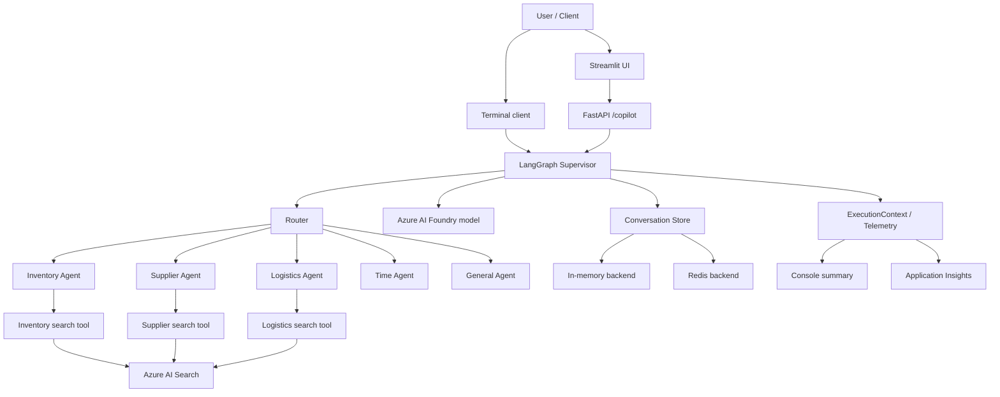

# Azure AI Foundry + LangGraph Multi-Agent Copilot

A production-oriented reference implementation of a **multi-agent supply-chain copilot** built with Azure AI Foundry, LangGraph, Azure AI Search, FastAPI, Streamlit, Azure Monitor, and optional Redis-backed conversation memory.

The project demonstrates how to move from a single LLM call to an observable, testable application with specialist agents, hybrid retrieval, grounded evidence, session memory, deterministic evaluation, a REST API, and a web UI.


## Highlights

- Supervisor-based orchestration with LangGraph
- Inventory, Supplier, Logistics, Time, and General specialists
- Dynamic single-agent and multi-agent routing
- Focused query planning for each specialist
- Azure AI Search hybrid retrieval with vector embeddings
- Exact entity protection to avoid substituting similar materials
- Grounded responses with title, source, and entity evidence
- Conversation sessions with in-memory or Redis storage
- Structured execution telemetry and Azure Monitor export
- FastAPI endpoints with Swagger documentation
- Streamlit chat and observability dashboard
- Deterministic evaluation dataset and CLI runner
- 125 automated tests in the validated v1.0.0 release

## Architecture



## Repository layout

```text
apps/
  api/             FastAPI application
  streamlit/       Chat and observability UI
  supervisor/      Terminal client
data/documents/    Sample inventory, supplier, and logistics records
evaluation/        Evaluation models, dataset, runner, and ignored results
graphs/            LangGraph supervisor workflow
scripts/           Search index, upload, and evaluation commands
shared/            Settings, tools, retrieval, telemetry, memory, and clients
tests/             Automated test suite
```

## Prerequisites

- Python 3.12+
- Azure AI Foundry project
- Chat model deployment in the Foundry project
- Embedding model deployment
- Azure AI Search service
- Optional: Application Insights for remote telemetry
- Optional: Redis or Azure Managed Redis for persistent sessions

## Installation

```powershell
# Clone and enter the repository
git clone https://github.com/cassiofrd/azure-ai-foundry-langgraph-agents.git
cd azure-ai-foundry-langgraph-agents

# Create and activate the virtual environment
python -m venv .venv
.\.venv\Scripts\Activate.ps1

# Install dependencies
python -m pip install --upgrade pip
pip install -r requirements.txt

# Create the local configuration file
Copy-Item .env.example .env
```

Fill in the Azure endpoints and credentials in `.env`. The real `.env` file is ignored by Git.

## Azure AI Search setup

The repository includes sample documents for inventory, suppliers, and logistics.

> `create_search_index` deletes an existing index with the configured name before recreating it. Use it only when that behavior is intended.

```powershell
python -m scripts.create_search_index
python -m scripts.upload_documents
```

## Run the terminal client

```powershell
python -m apps.supervisor.main
```

Available commands:

```text
reset                Clear the active session
session <session-id> Switch sessions
exit                  Close the client
```

## Run the REST API

```powershell
uvicorn apps.api.main:app --reload --host 127.0.0.1 --port 8000
```

Open the interactive API documentation at:

```text
http://127.0.0.1:8000/docs
```

Main endpoints:

```text
GET    /health
POST   /copilot
DELETE /sessions/{session_id}
```

Example request:

```json
{
  "session_id": "demo",
  "message": "Qual é o melhor plano de reposição do M10 considerando estoque, fornecedor e logística?"
}
```

## Run the Streamlit application

Keep the FastAPI server running in one terminal, then start Streamlit in another:

```powershell
python -m streamlit run apps/streamlit/app.py
```

The UI provides:

- chat sessions;
- grounded evidence;
- selected route and specialists;
- specialist queries;
- tool calls, latency, errors, and token usage;
- raw execution payload for debugging.

## Conversation storage

For local development without external infrastructure:

```env
CONVERSATION_STORE_BACKEND=memory
CONVERSATION_STORE_FALLBACK_TO_MEMORY=false
```

For persistent sessions:

```env
CONVERSATION_STORE_BACKEND=redis
REDIS_URL=<redis-connection-url>
CONVERSATION_STORE_FALLBACK_TO_MEMORY=false
```

An explicit fallback can be enabled, but the application displays a warning because persistence is disabled when Redis is unavailable:

```env
CONVERSATION_STORE_FALLBACK_TO_MEMORY=true
```

## Telemetry

Each workflow builds an `ExecutionContext` containing:

- execution ID and status;
- total duration;
- LLM calls and token usage;
- tool calls and timings;
- selected agents and specialist queries;
- errors.

Console summaries are enabled by default. Application Insights export can be enabled with:

```env
AZURE_MONITOR_ENABLED=true
APPLICATIONINSIGHTS_CONNECTION_STRING=<connection-string>
```

Example KQL query:

```kusto
customEvents
| where name == "agent.execution.completed"
| order by timestamp desc
```

## Automated evaluation

Start the API, then run:

```powershell
python -m scripts.run_evaluation
```

The deterministic evaluation verifies route selection, participants, tools, evidence entities, required answer terms, forbidden terms, latency limits, and token statistics.

The report is written to:

```text
evaluation/results/latest.json
```

Generated evaluation reports are ignored by Git; only `.gitkeep` is committed.

## Tests

```powershell
pytest -q
```

The validated v1.0.0 release passes **125 tests**. A Starlette deprecation warning may appear from the current FastAPI test-client dependency chain; it does not affect test success or runtime behavior.

## Example multi-agent flow

Question:

```text
Qual é o melhor plano de reposição do M10 considerando a política de estoque, o fornecedor e as opções de transporte?
```

Expected orchestration:

```text
Route: inventory_supplier_logistics
Participants: inventory, supplier, logistics
Tools:
- search_inventory_documents
- search_supplier_documents
- search_logistics_documents
```

The supervisor combines confirmed facts, marks partially supported conclusions, lists missing information, and returns one deduplicated evidence section.

## Security notes

- Never commit `.env`, API keys, connection strings, or the `.git` directory inside shared ZIP files.
- Prefer managed identity and Key Vault for deployed environments.
- The bundled documents are synthetic examples and contain no production data.
- The API is intentionally unauthenticated for local development; add Microsoft Entra ID before exposing it publicly.

## Release scope

Version 1.0.0 is a local/reference implementation. Production hardening may include:

- Microsoft Entra ID authentication and authorization;
- managed identity and Key Vault;
- CI/CD and deployment manifests;
- load, resilience, and security testing;
- Azure Managed Redis and private networking;
- cost controls and model-specific rate-limit handling.

## License

MIT — see [LICENSE](LICENSE).
